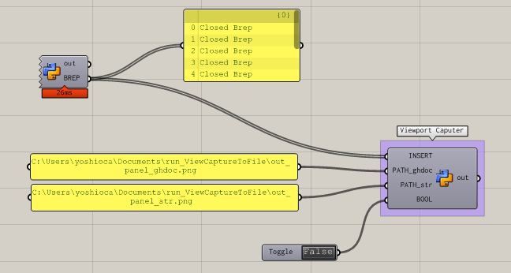
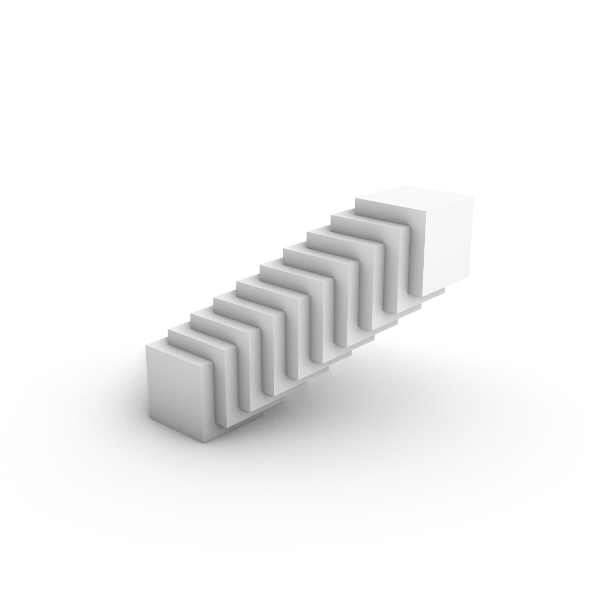

# run_ViewCaptureToFile  


Grasshopper から、Bake して、ビューポートをキャプチャして画像にして保存する。  
パスや、あれこれいつも迷うので、一回まとめる。  

  

output image ↓  

  


---  


### Code  


Bake する際に、 GUID 渡しではなく、ジオメトリ渡しになる。  
以下の、 BREP 部分。  

```Python
sc.doc = Rhino.RhinoDoc.ActiveDoc
sc.doc.Objects.AddBrep(BREP)
```

事前に、ジオメトリのリストにしておくと良さそう。  
コンポーネントからコンポーネントに渡す際に、勝手に GUID になるっぽいので、これを Bake + Capture をまわすコンポーネントの中で行う必要がある。  

```Python
def brep_list_from_guid_list(brep_list):
    bl = []
    
    for i in xrange(len(brep_list)):
        bl.append(rs.coercebrep(brep_list[i]))
      
    return bl
```

クエリについて、Rhino6 の仕様なのか知らんけど、-ViewCaptureToFile は、オプションが先に。  
```Python
query = "-ViewCaptureToFile "+ \
    " W=1080 H=1080 S=1 L=_No D=_No R=_No A=_No T=_No " + _path_

rs.Command(query)
```


---  


### ghPython のパス文字列の操作  


Windows での文字列操作にいつも迷う。  
3種類を試す。  


- (1) ghPython のコード内で書く  

  バックスラッシュを2個重ねるか、頭に r をつけて（raw文字列にして）エスケープシーケンスを無効化する。  

  ```Python
  p = "C:\\Users\\yoshioca\\Documents\\run_ViewCaptureToFile\\out_python.png"

  p = r"C:\Users\yoshioca\Documents\run_ViewCaptureToFile\out_python.png"
  ```


- (2) Panel に書き込んで、ghPython コンポーネントに入れる。(type hint : ghdoc Object when geomrtry)  

  パネルに直接書く。バックスラッシュは重ねない（エスケープシーケンスが無い）  

  ```xml
  C:\Users\yoshioca\Documents\run_ViewCaptureToFile\out_panel_ghdoc.png
  ```


- (3) Panel に書き込んで、ghPython コンポーネントに入れる。(type hint : str)  

  パネルに直接書く。バックスラッシュは重ねない（エスケープシーケンスが無い）

  ```xml
  C:\Users\yoshioca\Documents\run_ViewCaptureToFile\out_panel_str.png
  ```


---  